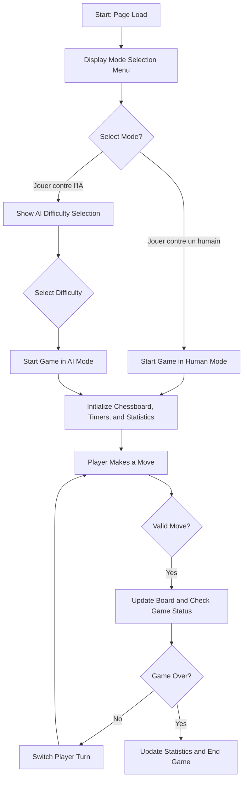

# DFWS Chess

DFWS Chess is a premium dark-mode chess game built with HTML, CSS, and JavaScript. You can play either against an AI with selectable difficulty levels or against a human (taking turns on the same screen). The game includes a statistics panel and timers for both players.

## Features

- **Premium Dark Mode UI:** A modern, sleek interface with dark-themed styling.
- **Mode Selection:** Start by choosing to play against an AI or a human.
- **AI Difficulty Levels:** Choose from Noob, Easy, Regular, Hard, Magnus Carlsen, and Unbeatable.
- **Game Statistics:** View stats for games played, wins, losses, and draws.
- **Countdown Timers:** 10-minute countdowns for both White and Black.
- **Responsive Chessboard:** Interactive chessboard rendered dynamically.

## How to Play

1. Open the `index.html` file in your browser (or use the VS Code Live Server extension).
2. Select your mode in the main menu:
   - **Jouer contre l'IA:** Triggers AI mode.
   - **Jouer contre un humain:** Starts a human vs human game.
3. If you choose AI mode, select the difficulty level. The game will then begin.
4. Play by clicking on pieces and valid moves will be highlighted.
5. The game’s timers and statistics are updated in real-time.
6. The game ends when a king is captured or a timer expires.

## Installation

Clone the repository then open the project folder in Visual Studio Code:

```bash
git clone https://github.com/yourusername/chess-with-ai.git
cd chess-with-ai
```

Open `index.html` in your preferred browser.

## Project Structure

```
├── index.html          // Main HTML file with the game interface and mode selection.
├── styles.css          // Dark mode premium styling.
├── script.js           // Game logic, AI functions, and UI interactions.
└── README.md           // Project documentation.
```

## Game Flow Diagram



## Credits

Developed by DFWS Chess Team.

## License

This project is licensed under the MIT License.
